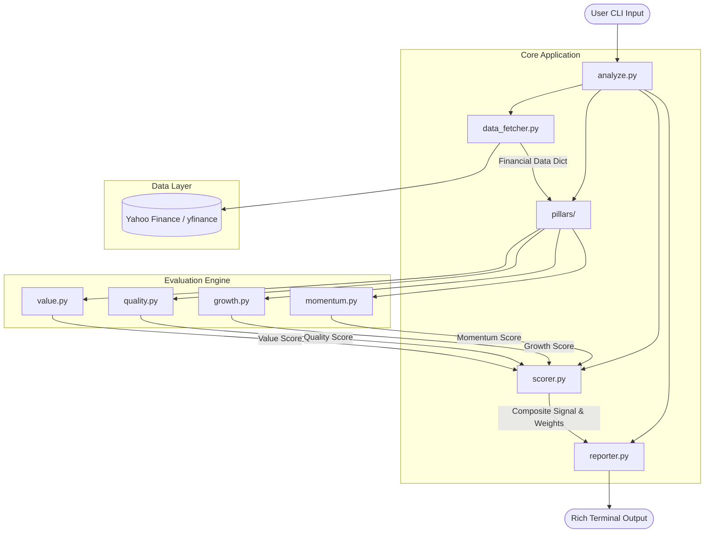

# Stock Evaluator

A robust, terminal-based stock evaluation framework that mimics institutional quantitative methodologies. It analyzes equities across four critical pillars: **Value, Quality, Growth, and Momentum**.

## How to Run

1. Install dependencies:
   ```bash
   pip install -r requirements.txt
   ```
2. Run the evaluator for any stock ticker:
   ```bash
   python analyze.py AAPL
   ```

## Architecture

The Stock Evaluator is designed with a **modular, data-driven architecture**. It separates the concerns of data fetching, mathematical scoring, and terminal presentation. 

This decoupling ensures that you can easily swap out the data provider (e.g., moving from Yahoo Finance to a paid API) or the UI (e.g., adding a web frontend) without having to rewrite the core financial logic.



### Core Components

1. **`analyze.py` (The Controller)**: The entry point of the application. It parses command-line arguments and orchestrates data flow.
2. **`data_fetcher.py` (The Data Abstraction Layer)**: Acts as the single source of truth for external data. Currently uses `yfinance`.
3. **`pillars/` (The Evaluation Engine)**: Contains independent modules (`value.py`, `quality.py`, `growth.py`, `momentum.py`) that return standardized 0-100 scores.
4. **`scorer.py` (The Weighting System)**: Aggregates pillar scores using weighted algorithms to generate composite signals (e.g., Buy, Sell).
5. **`reporter.py` (The Presentation Layer)**: Renders the beautiful `rich` ASCII UI in the terminal.

## Batch Evaluation
You can also run batch processing scripts to evaluate multiple stocks sequentially:
```bash
python batch_analyze.py 10
```
